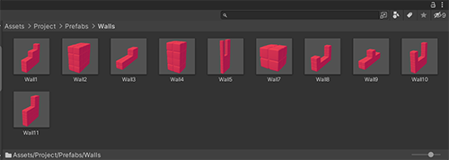
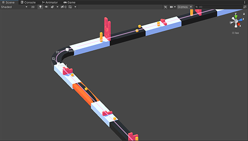
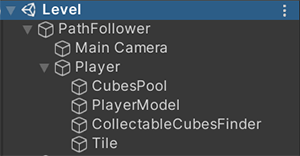
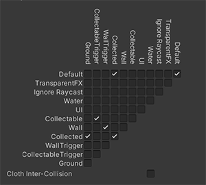

# CubeSurferClone

The project uses Unity-2021.1.12.f1

CubeSurferClone is a clone of the game from Playmarket:
 https://play.google.com/store/apps/details?id=com.Atinon.PassOver

I'll start with a description of the level:

The entire level consists of only 3 components.

The Road.

The Walls.

And cubes that we can collect.

I optimized the walls a little, making them prefabs, and combining the colliders of all cubes.

Also, there is a bezier curve at the level indicating the direction.

--------------------------------------------------------------------------------------------------------------------------------------

Now let's talk a little about the player.

Тhis is his scene hierarchy.

* At the root is the PathFollower, when the game starts it starts to follow the path of the curve.
	In his childrance are the player and the camera:

	Camera does not have its own components, it only moves behind the point because it is in local coordinates

	Player has a component HorizontalMover that takes input from the joystick and moves the player to the left 
	and right in local coordinates.

	And also in Player childrance we have:
	
	CubesPool, which stores and can create CollectedCubes when told to do so.
	PlayerModel, it stores the 3d model of the player, in our case it is a ball.
	CollectableCubeFinder, which has a Trigger Collider and when it collides with CollectableCube then destroys it and tells the pool to create a CollectedCube
	Tail, only draws an orange tail after the player.

Let me remind you that the physics in the project is optimized and all unnecessary collisions are disabled, but all the necessary checks in OnTriggerEnters are still performed.

